<div align="center">

# CyberSuite

### Your Complete Cybersecurity Suite for Passwords, Files, Scanning, and Security Training

[](LICENSE)
[]()
[]()
[]()
[]()

Protecting digital life with AES-256 encryption, password management, network scanning, file vaulting, and hands-on security education.

</div>

<div align="center">

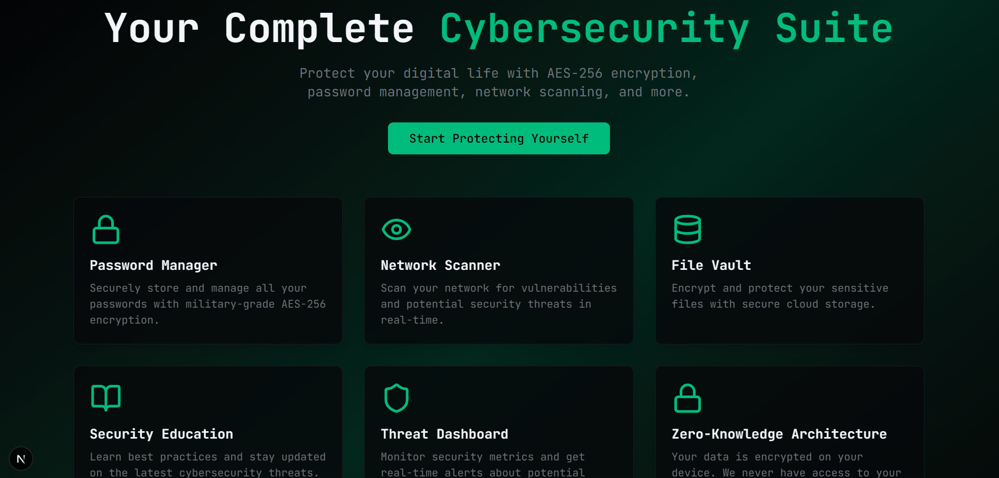

<a href="https://youtu.be/_SlmBWYKhsk" target="_blank" rel="noopener noreferrer">
  
</a>

</div>

---

## Index

- [Screenshots](#screenshots)
- [Executive Snapshot](#executive-snapshot)
- [Why CyberSuite Stands Out](#why-cybersuite-stands-out)
- [Core Modules](#core-modules)
- [Tech Stack](#tech-stack)
- [Security Architecture](#security-architecture)
- [Installation](#installation)
- [Project Structure](#project-structure)
- [API Endpoints](#api-endpoints)
- [Testing](#testing)
- [Contributing](#contributing)
- [License](#license)
- [Author](#author)

---

## Screenshots

### Dashboard

<div align="center">

| Light Mode | Dark Mode |
| --- | --- |
| 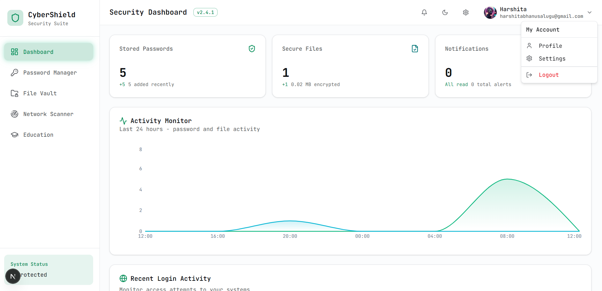 | 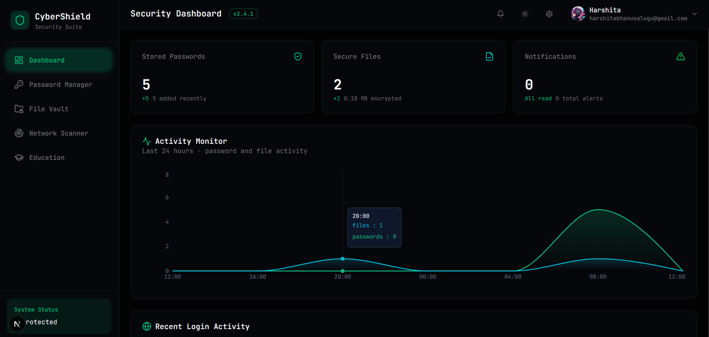 |

</div>

### Password Manager

<div align="center">

| Password Vault | Add Credential |
| --- | --- |
| 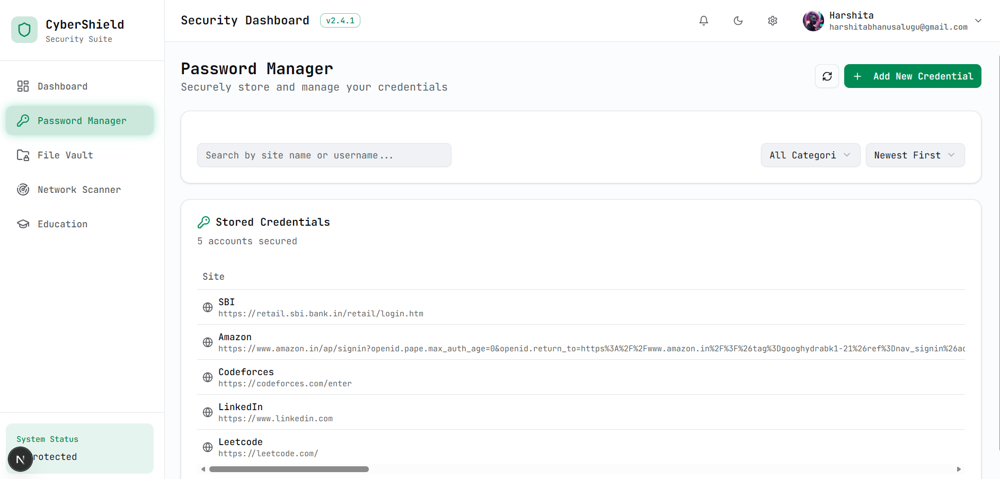 | 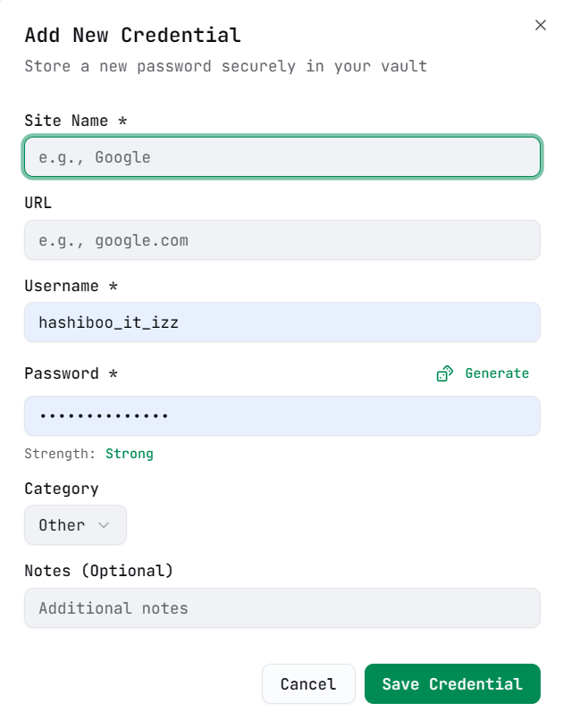 |

| Dark Vault | ML Password Analysis |
| --- | --- |
| 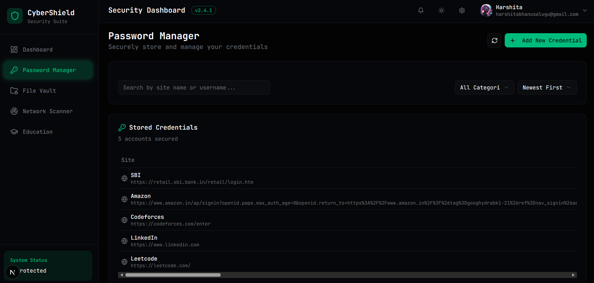 | 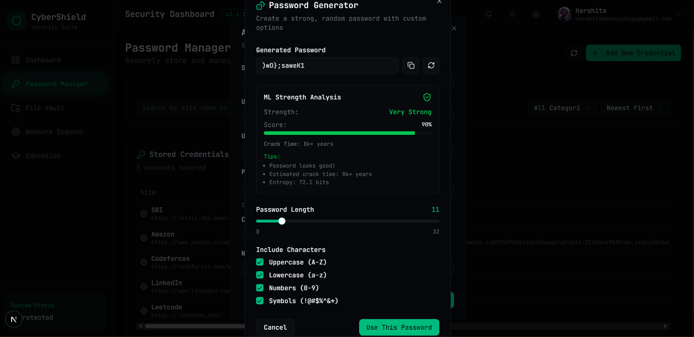 |

</div>

### Security Tools

<div align="center">

| Two-Factor Authentication | Network Scanner |
| --- | --- |
| 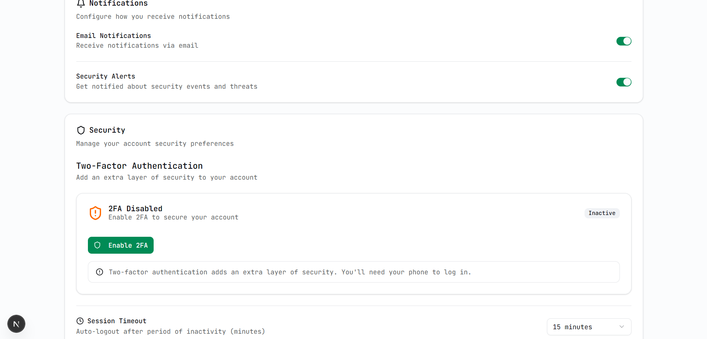 | 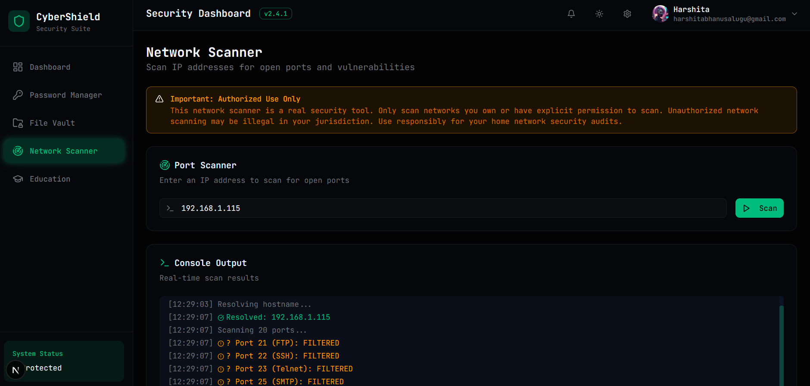 |

| File Vault | Profile & Settings |
| --- | --- |
| 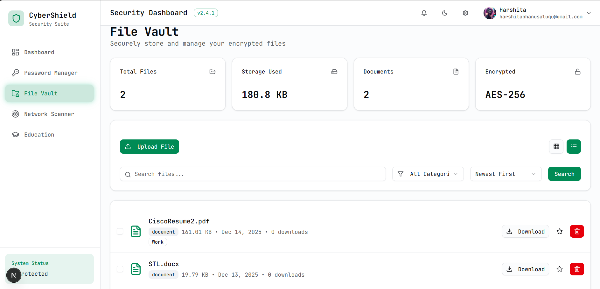 | 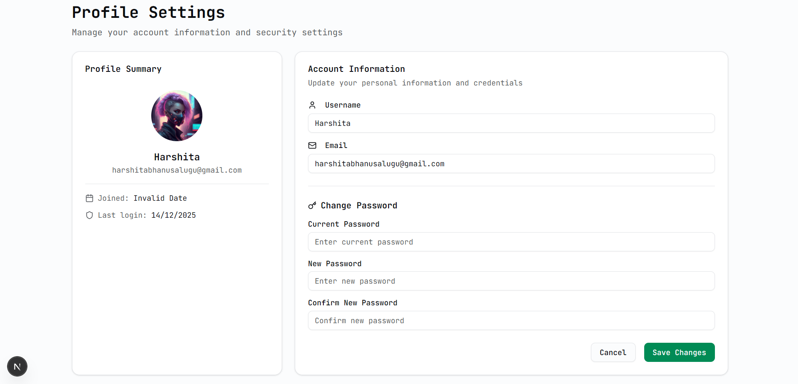 |

</div>

### Education and Data

<div align="center">

| Learning Hub | Database View |
| --- | --- |
| 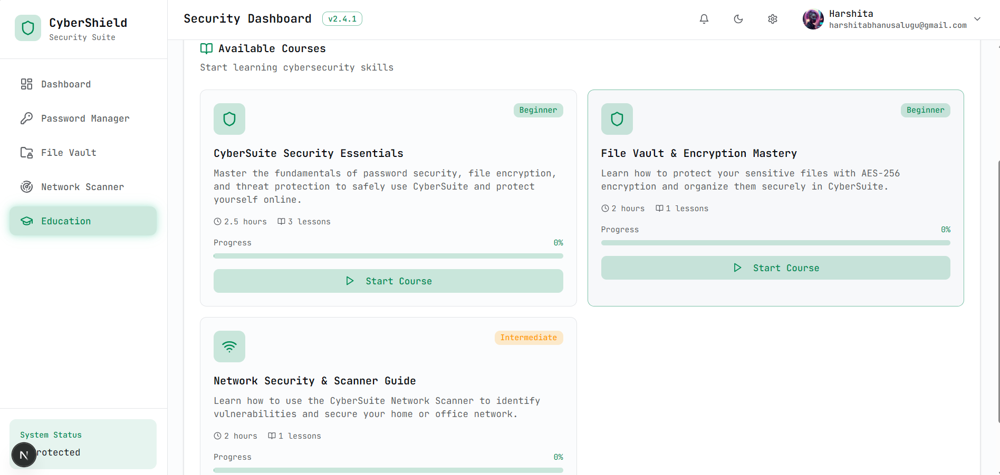 | 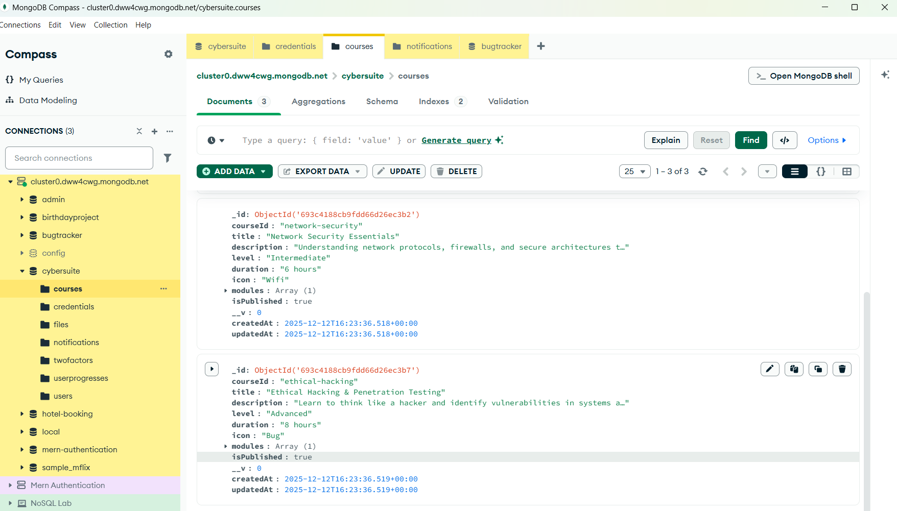 |

</div>

---

## 🚀 Executive Snapshot

CyberSuite is a full-stack cybersecurity platform built to showcase practical security engineering in one product. It combines encrypted credential storage, protected file handling, live network scanning, two-factor authentication, ML-assisted threat analysis, and guided security education into a single polished experience.

This README is designed to make the value obvious quickly for managers, recruiters, and technical reviewers: the product looks professional, the security story is clear, and the implementation spans frontend, backend, and ML services.

<div style="border:1px solid #1f2937;border-radius:16px;padding:16px 18px;background:linear-gradient(135deg, rgba(16,185,129,0.08), rgba(34,197,94,0.03));margin:18px 0;">
  <strong>📌 Snapshot:</strong> One platform, multiple security layers, and a polished product story that signals real engineering depth fast.
</div>

### Highlights at a glance

<table>
  <tr>
    <td width="33%"><strong>Security First</strong><br/>AES-256-GCM, 2FA, HttpOnly cookies, and validation-driven flows.</td>
    <td width="33%"><strong>Real Features</strong><br/>Password vault, network scanner, file vault, and ML support.</td>
    <td width="33%"><strong>Presentation Ready</strong><br/>A polished product story designed to win fast attention.</td>
  </tr>
</table>

| Capability | Value |
| --- | --- |
| Password Security | AES-256-GCM encrypted credential vault with search, filtering, and strength analysis |
| Network Scanning | TCP-based scanning for common ports and security exposure checks |
| File Protection | Encrypted upload and secure download flow for sensitive files |
| Security Training | Course-based education module with progress tracking |
| ML Intelligence | Login anomaly detection and password analysis support |

---

## ✨ Why CyberSuite Stands Out

CyberSuite is more than a demo app. It presents a coherent security platform with a strong visual identity and a practical feature set that maps directly to real-world concerns.

<div align="center">

| What a recruiter sees | Why it matters |
| --- | --- |
| Clear product vision | It reads like a finished platform, not a classroom exercise |
| Real engineering depth | Security, backend, frontend, and ML all show up in one system |
| Strong product polish | The first screen communicates confidence and momentum |

</div>

<div style="display:grid;grid-template-columns:repeat(auto-fit,minmax(220px,1fr));gap:12px;margin:18px 0;">
  <div style="border:1px solid #1f2937;border-radius:14px;padding:14px 16px;background:#0b1220;">
    <div style="font-weight:700;margin-bottom:6px;">🎯 Clear product vision</div>
    <div>It reads like a finished platform, not a classroom exercise.</div>
  </div>
  <div style="border:1px solid #1f2937;border-radius:14px;padding:14px 16px;background:#0b1220;">
    <div style="font-weight:700;margin-bottom:6px;">🧠 Real engineering depth</div>
    <div>Security, backend, frontend, and ML all show up in one system.</div>
  </div>
  <div style="border:1px solid #1f2937;border-radius:14px;padding:14px 16px;background:#0b1220;">
    <div style="font-weight:700;margin-bottom:6px;">🪄 Strong product polish</div>
    <div>The first screen communicates confidence and momentum.</div>
  </div>
</div>

- Zero-knowledge style password storage with authenticated encryption
- Real network scanning instead of placeholder UI
- Secure file vault behavior with client-side protection flow
- 2FA support and security settings surfaced in the user experience
- Educational content to demonstrate product thinking beyond raw tooling
- A polished landing page that communicates value fast

---

## 🧩 Core Modules

<table>
  <tr>
    <td width="50%"><strong>🔐 Password Manager</strong><br/>Encrypted credential storage with generation, analysis, and retrieval.</td>
    <td width="50%"><strong>🕵️ Network Scanner</strong><br/>Authorized TCP scanning with exposure hints and readable results.</td>
  </tr>
  <tr>
    <td><strong>📦 File Vault</strong><br/>Encrypted upload and download handling for sensitive documents.</td>
    <td><strong>🎓 Security Education</strong><br/>Course-based learning with progress tracking and practical guidance.</td>
  </tr>
  <tr>
    <td><strong>🛡️ Two-Factor Authentication</strong><br/>TOTP verification, QR setup, and backup recovery codes.</td>
    <td><strong>🤖 ML Security Intelligence</strong><br/>Anomaly detection and password analysis through a dedicated service.</td>
  </tr>
</table>

### Password Manager

- AES-256-GCM credential encryption
- Password generation and strength analysis
- Search, filtering, and category organization
- Secure storage and retrieval flows

### Network Scanner

- TCP port scanning for common service ports
- Hostname and IP-based scanning support
- Vulnerability and exposure hints for insecure services
- Console-style and dashboard-style scanning views

### File Vault

- Encrypted file upload and download flow
- Metadata tracking and access control
- Secure handling for sensitive documents

### Security Education

- Course-based learning experience
- Progress tracking across lessons
- Content aimed at security awareness and best practices

### Two-Factor Authentication

- TOTP-based verification flow
- QR code setup for authenticator apps
- Backup code support for recovery

### ML Security Intelligence

- Login anomaly detection support
- Password analysis enhancements
- Separate Python microservice for ML workloads

---

## 🛠️ Tech Stack

<table>
  <tr>
    <td width="33%"><strong>🧱 Frontend</strong><br/>Next.js 15, React 19, TypeScript, Tailwind CSS, shadcn/ui</td>
    <td width="33%"><strong>⚙️ Backend</strong><br/>Node.js, Express, MongoDB, Mongoose, JWT, bcryptjs, Multer</td>
    <td width="33%"><strong>🧪 ML Service</strong><br/>Python 3.x, Flask, scikit-learn, pandas, numpy, joblib</td>
  </tr>
</table>

### Frontend

- Next.js 15
- React 19
- TypeScript
- Tailwind CSS
- shadcn/ui

### Backend

- Node.js
- Express.js
- MongoDB
- Mongoose
- JWT
- bcryptjs
- Multer
- Speakeasy
- Nodemailer

### ML Service

- Python 3.x
- Flask
- scikit-learn
- pandas
- numpy
- joblib

---

## 🔒 Security Architecture

CyberSuite is built around defense-in-depth.

<div style="border-left:4px solid #10b981;padding:14px 16px;margin:16px 0;background:rgba(16,185,129,0.05);border-radius:12px;">
  <strong>🛡️ Defense in depth:</strong> the platform treats identity, data, and operational safety as separate concerns, not one blended control.
</div>

<table>
  <tr>
    <td width="50%"><strong>🪪 Identity & Session</strong><br/>JWT, HttpOnly cookies, SameSite enforcement, and 2FA.</td>
    <td width="50%"><strong>🧷 Data Protection</strong><br/>AES-256-GCM, secure file handling, and encrypted credential flows.</td>
  </tr>
  <tr>
    <td><strong>🧱 App Hardening</strong><br/>Helmet, rate limiting, validation, and size limits.</td>
    <td><strong>⚡ Operational Safety</strong><br/>Dedicated ML service and controlled password reset flows.</td>
  </tr>
</table>

- Authenticated encryption for sensitive credential and file workflows
- HttpOnly cookie-based session handling
- CSRF-aware cookie configuration
- Input validation on user-facing endpoints
- Rate limiting and security headers
- Password reset flow with time-limited tokens
- Separate ML service for isolated processing

---

## 🧰 Installation

<div align="center">

| Step 1 | Step 2 | Step 3 |
| --- | --- | --- |
| Clone | Configure | Run |

</div>

<div style="border:1px dashed #334155;border-radius:14px;padding:14px 16px;margin:16px 0;background:rgba(15,23,42,0.55);">
  <strong>🧭 Setup flow:</strong> clone the repo, wire the environment variables, then start the backend, frontend, and optional ML service.
</div>

### Prerequisites

- Node.js 18 or later
- MongoDB 6 or later
- Python 3.8 or later for ML features
- npm or pnpm

### Clone the repository

```bash
git clone https://github.com/Git-brintsi20/CyberSuite.git
cd CyberSuite/cybersecurity-suite
```

### Backend setup

```bash
cd server
npm install
```

Create `server/.env`:

```env
MONGO_URI=your_mongodb_connection_string
JWT_SECRET=your_jwt_secret_key
ENCRYPTION_KEY=your_64_character_hex_key
PORT=5000
NODE_ENV=development
FRONTEND_URL=http://localhost:3000
SMTP_HOST=smtp.gmail.com
SMTP_PORT=587
SMTP_USER=your_email@gmail.com
SMTP_PASSWORD=your_app_password
EMAIL_FROM=CyberSuite <your_email@gmail.com>
ML_SERVICE_URL=http://localhost:5001
```

### Frontend setup

```bash
cd ../client
npm install
```

Create `client/.env.local`:

```env
NEXT_PUBLIC_API_URL=http://localhost:5000
```

### Optional ML service setup

```bash
cd ../server/ml_service
pip install -r requirements.txt
```

### Run locally

Backend:

```bash
cd server
npm start
```

Frontend:

```bash
cd client
npm run dev
```

ML service:

```bash
cd server/ml_service
python app.py
```

---

## 🗂️ Project Structure

<div align="center">

The structure is intentionally split between a modern frontend, a secure API layer, and an isolated ML service.

</div>

```text
cybersecurity-suite/
├── client/                 # Next.js frontend application
│   ├── app/                # App Router pages
│   ├── components/        # UI and feature components
│   ├── contexts/          # React context providers
│   ├── hooks/             # Custom hooks
│   └── lib/               # Utilities and API helpers
└── server/                # Express backend and services
    ├── controllers/       # Request handlers
    ├── middleware/        # Auth and logging middleware
    ├── models/            # MongoDB models
    ├── routes/            # API routes
    ├── utils/             # Encryption and helper utilities
    └── ml_service/        # Python ML microservice
```

---

## 🌐 API Endpoints

<div align="center">

The API surface is organized around the product’s major workflows so the architecture stays easy to understand.

</div>

### Authentication

- `POST /api/auth/register`
- `POST /api/auth/login`
- `POST /api/auth/login/2fa`
- `POST /api/auth/logout`
- `GET /api/auth/me`

### Password Management

- `GET /api/passwords`
- `POST /api/passwords`
- `PUT /api/passwords/:id`
- `DELETE /api/passwords/:id`
- `POST /api/passwords/:id/decrypt`

### Two-Factor Authentication

- `POST /api/2fa/setup`
- `POST /api/2fa/verify`
- `POST /api/2fa/validate`
- `POST /api/2fa/disable`
- `GET /api/2fa/status`

### File Vault

- `GET /api/files`
- `POST /api/files/upload`
- `GET /api/files/:id/download`
- `DELETE /api/files/:id`

### ML Service

- `GET /api/ml/health`
- `POST /api/ml/analyze-password`
- `POST /api/ml/detect-anomaly`
- `POST /api/ml/train`

### Education

- `GET /api/education/courses`
- `GET /api/education/courses/:id`
- `POST /api/education/progress`

---

## 🧪 Testing

Use the application locally and verify the main flows:

<table>
  <tr>
    <td width="20%"><strong>01</strong></td>
    <td>Open the app and confirm the landing page loads cleanly.</td>
  </tr>
  <tr>
    <td><strong>02</strong></td>
    <td>Create an account or log in and verify authentication.</td>
  </tr>
  <tr>
    <td><strong>03</strong></td>
    <td>Exercise the password manager, file vault, scanner, and education flows.</td>
  </tr>
</table>

1. Open `http://localhost:3000`
2. Register or log in
3. Test the password manager and file vault
4. Run a scan in the network scanner
5. Review the education module and profile settings

---

## 🤝 Contributing

Contributions are welcome. Please keep changes focused, secure, and consistent with the current architecture.

<div align="center">

| Fork | Branch | Commit | Pull Request |
| --- | --- | --- | --- |

</div>

1. Fork the repository
2. Create a feature branch
3. Commit your changes
4. Open a pull request

---

## License

This project is licensed under the MIT License. See [LICENSE](LICENSE) for details.

---

## Author

**Git-brintsi20**

- GitHub: [@Git-brintsi20](https://github.com/Git-brintsi20)
- Repository: [CyberSuite](https://github.com/Git-brintsi20/CyberSuite)

---

<div align="center">

If this project helps, star it and share the demo.

Made with care for a more secure digital world.

</div>

<div style="border:1px solid #1f2937;border-radius:14px;padding:14px 16px;margin:16px 0;background:rgba(59,130,246,0.06);">
  <strong>💡 Contribution goal:</strong> small, high-signal changes that improve the user experience, strengthen security, or sharpen the product narrative.
</div>